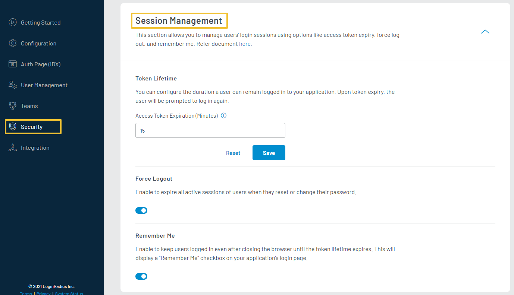
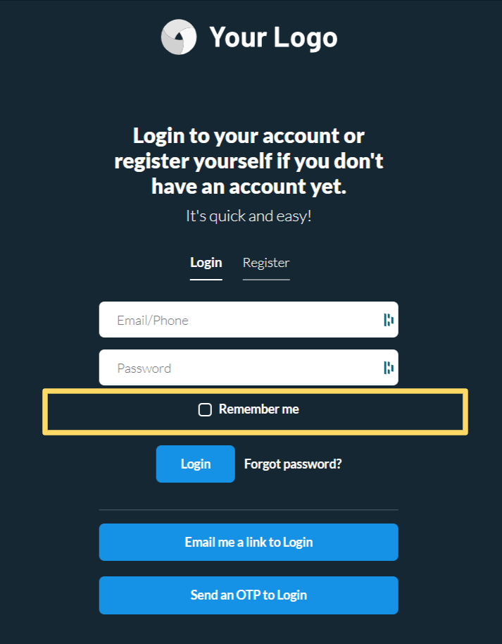

Session Management allows you to control and manage your customer’s login session. LoginRadius Identity Platform supports three different aspects to manage sessions for your customers.

- Token Lifetime
- Force Logout
- Remember Me

To access **Session Management** options, login to your [LoginRadius Dashboard](https://dashboard.loginradius.com/dashboard) account, from the left navigation panel, click the **Security** and then navigate to the **Session Management** section.
Click the down arrow or anywhere within the section and the **Session Management** screen will appear:

  

 

## Token Lifetime
**Token lifetime** is the amount of time a customer is logged in to your application until it expires and prompts the customer to log back in. This feature allows you to set the token expiration time and extend the token validity if it has been accessed/used before the expiration time.

**Use Case**: A token having the expiration at 7.00 will be extended to the configured expiration time if your customer logged in before the expiry (i.e., 7.00).

> The default token lifetime is 15 min and configurable from 15 min to 24 hours. 

## Force Logout
**Force Logout** enables you to expire all active sessions of the customer account on Password Reset or Change, except the session in which the password has been reset/changed.

## Remember Me
**Remember Me** feature allows your customer to stay logged in until the access token expires, even after the browser is closed. 

> Remember me expiry duration will be same as token lifetime.

By enabling this option, a Remember Me checkbox will show up on your IDX - Auth Page `<your-app-name>.hub.loginradius.com/auth.aspx` as highlighted in the below screen. 

  

 
