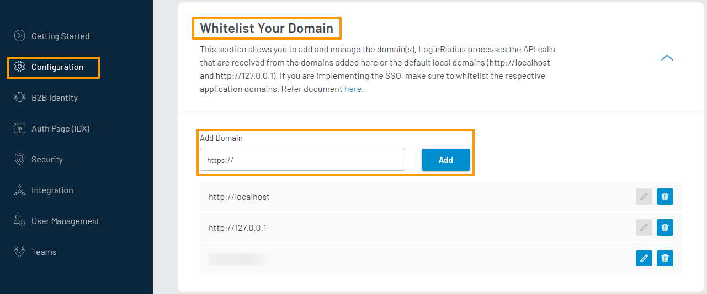

# Get Started - ASP&#46;NET Core Razor Pages

The purpose of this tutorial is to help you with implementing LoginRadius user registration, log in and log out functionalities in your ASP&#46;NET Core Razor Pages web application.

> You must have the &#46;NET 5.0 SDK installed or later.

When you signed up for a LoginRadius account, an app was created for you. This app is linked to a ready to use web page, known as the [Auth Page (IDX)](/concepts/idx). When you make changes to your configurations in the LoginRadius Dashboard, your changes will automatically be reflected on your Auth Page (IDX). You can utilize this web page for your authentication requirements in your web application.

> [Create an account](https://accounts.loginradius.com/auth.aspx?return_url=https://dashboard.loginradius.com/login&action=register) to get started if you don't have one yet!

## Choose Theme

In your LoginRadius Dashboard, navigate to the **Auth Page (IDX)** section located in the left navigation bar and click the **Theme Customization** section. There you can select a design theme for your login page, or further customize the content displayed:


To preview your theme and content, click the **Go to your Login Page** link as highlighted on the above screen. There are various features already implemented on your Auth Page, such as Email and Password Login, User Registration, Forgot Password, and Remember Password.

## Get Credentials

Before using any of the APIs or methods that LoginRadius provides, you will need to retrieve your **App Name**, **API Key**, and **API Secret**.

In your LoginRadius Dashboard, navigate to **[Configuration > API Credentials](https://dashboard.loginradius.com/configuration)**, and click the **API Key And Secret** subsection to retrieve your API Credentials.


## SDK Installation

This tutorial assumes that you are following the Razor Page design pattern in your web application and uses the LoginRadius &#46;NET SDK to make API calls to LoginRadius.

Run the following command in the NuGet Package Manager Console:

```
PM> Install-Package LoginRadiusSDK.NET
```

## Configuration

Go to your `appsettings.json` file in your project, and add the following object to your JSON configuration:

```json
"loginradius": {
    "apiKey": "__API_KEY__",
    "apiSecret": "__API_SECRET__",
    "appName" : "__LoginRadius_APP_NAME__",
    "connectionTimeout" : "30000",
    "requestRetries" : "0",
    "domainName" : "https://api.loginradius.com/"
}
```

Replace the following placeholders in the above config in `appsettings.json`:

- apiKey: **API Key** obtained in the [Get Credentials](#get-credentials) step.
- apiSecret: **API Secret** obtained in the [Get Credentials](#get-credentials) step.
- appName: **App Name** obtained in the [Get Credentials](#get-credentials) step.

## Configure Registration and Login URLs

> In this tutorial, we are using Auth Page(IDX) for authentication, where Registration and Login functionality is already implemented.

Navigate your Register or Login links or buttons to the following URLs:

**Registration Page URL:**

`https://<LoginRadius APP Name>.hub.loginradius.com/auth.aspx?action=register&return_url=<Return URL>`

**Login Page URL:**

`https://<LoginRadius APP Name>.hub.loginradius.com/auth.aspx?action=login&return_url=<Return URL>`

**Where:**

- **LoginRadius App Name** is the name of your app as mentioned in Get Credential step.
- **return_url** is where you want to redirect users upon successful registration or login. [Whitelist your domain](#whitelist-your-domain) if you are not using Local Domain for this tutorial.

> return_url can be your website, frontend app, or backend server url where you are handling the access token. In the case of this tutorial, this would be the page in your web application where you will process the received access token and retrieve the LoginRadius user profile.

## Setup Profile Page

Create a Profile Page to redirect to after authentication and add the view and page model as explained below:

**Profile.cshtml**

Add the following view under `/Pages/Profile.cshtml`.

```html
@page
@model RazorPagesDemoApplication.Pages.ProfileModel
@{
  ViewData["Title"] = "Your LoginRadius Profile";
}

<h2>Your LoginRadius Profile</h2>

<div class="text-center">
  <h1 class="display-4">Access Token: @Model.Token</h1>
  <h3>Email: @ViewData["email"]</h3>
  <p>Error: @ViewData["error"]</p>
</div>
```

**Profile.cshtml.cs**

Add the following page model under `/Pages/Profile.cshtml.cs`.

```csharp
using Microsoft.AspNetCore.Mvc;
using Microsoft.AspNetCore.Mvc.RazorPages;

namespace RazorPagesDemoApplication.Pages
{
    public class ProfileModel : PageModel
    {
        [BindProperty(SupportsGet = true)]
        public string Token { get; set; }
        public void OnGet()
        {
        }
    }
}

```

## Retrieve User Data using Access Token

> Once the authentication is done using Auth Page (IDX), the default script of LoginRadius sends an access token in the query string as a token parameter with the return_url. The return_url should be your application's web page where you would like to receive the access token.
> The following is an example of the access token in the query string with the Return URL:
>
> `<Return URL>?token=745******-3e8e-****-b3**2-9c0******1e.`

- Add the following namespaces in `/Pages/Profile.cshtml.cs` to allow us to work with the `GetProfileByAccessToken` SDK method easily:

  ```csharp
  using LoginRadiusSDK.V2.Api.Authentication;
  using LoginRadiusSDK.V2.Models.ResponseModels.UserProfile;
  ```

- Add the following API snippet to the `/Pages/Profile.cshtml.cs` `OnGet` method to retrieve the user profile using the received access token:

```csharp
if (Token == null)
{
    ViewData["error"] = "Expected token query parameter.";
    return;
}

var apiResponse = new AuthenticationApi().GetProfileByAccessToken(Token);

if (apiResponse.RestException != null)
{
    ViewData["error"] = apiResponse.RestException.Description;
    return;
}

  UserProfile profile = apiResponse.Response;
  ViewData["email"] = profile.Email[0].Value;
```

Your page model should look something like this:

```csharp
using Microsoft.AspNetCore.Mvc;
using Microsoft.AspNetCore.Mvc.RazorPages;
using LoginRadiusSDK.V2.Api.Authentication;
using LoginRadiusSDK.V2.Models.ResponseModels.UserProfile;

namespace RazorPagesDemoApplication.Pages
{
    public class ProfileModel : PageModel
    {
        [BindProperty(SupportsGet = true)]
        public string Token { get; set; }
        public void OnGet()
        {
            if (Token == null)
            {
                ViewData["error"] = "Expected token query parameter.";
                return;
            }

            var apiResponse = new AuthenticationApi().GetProfileByAccessToken(Token);

            if (apiResponse.RestException != null)
            {
                ViewData["error"] = apiResponse.RestException.Description;
                return;
            }

            UserProfile profile = apiResponse.Response;
            ViewData["email"] = profile.Email[0].Value;
        }
    }
}

```

## Run and See Result

- Start your Razor Pages web application.

- Open your Auth Page (IDX) registration URL `https://<LoginRadius APP Name>.hub.loginradius.com/auth.aspx?action=register&return_url=<Return URL>`. In this tutorial, the return URL was `https://localhost:<PORT>/Profile`. It should display something similar to:

  

- Register a user here and then log in. Upon successful login, it will redirect you to the page specified in the return url. In your page model, the LoginRadius SDK will return a user profile. The following displays the profile page described in [above example](#setup-profile-page):

  

## Whitelist Your Domain

For security reasons, LoginRadius will only process API calls coming from domains included in your app's whitelist. Local domains (http://localhost and http://127.0.0.1) are already whitelisted by default.

To whitelist your domain, in your LoginRadius Dashboard navigate to **[Configuration > Whitelist Your Domain](https://dashboard.loginradius.com/configuration)** and add your domain name:



## Recommended Next Steps

[How to manage email templates for verification and forgot password](/guide/customize-email-and-sms-settings)

[How to personalize interfaces and branding of login pages](/guide/customize-auth-page)

[How to configure SMTP settings for sending emails to consumers](/guide/setup-your-smtp-provider)

[How to implement Social Login options like Facebook, Google](/guide/social-login)

[How to implement Phone Login](/guide/phone-login)

[How to implement Passwordless Login](/guide/passwordless-login)

## Dotnet SDK Reference

[Dotnet SDK](/references/sdk/dotnet-sdk)

## API Reference

[APIs](/#api)

[Go Back to Home Page](/)
