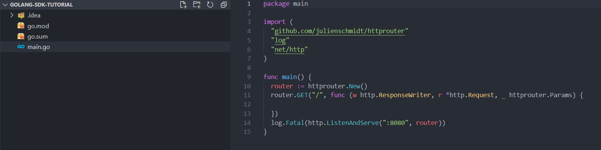

# Get Started - Golang

The tutorial lets you implement LoginRadius user registration, login, profile, and log out in your Golang based application.

> **Note:** You must have Go installed, and the minimum supported version is 1.13.0
>
> New to Golang? Check out [this reference](https://golang.org/doc/).

When you signed up for the LoginRadius account, it created an app for you. This app is linked to a ready to use web page - [Auth Page (IDX)](https://www.loginradius.com/docs/developer/concepts/idx-overview/).

Auth Page (IDX) reflects the configuration changes that you make in [LoginRadius Dashboard](https://dashboard.loginradius.com/getting-started). You can utilize this webpage for authentication requirements on your Golang application.

> **Note:** [Create an account](https://accounts.loginradius.com/auth.aspx?return_url=https://dashboard.loginradius.com/login&action=register) to get started if you don't have one yet!

## Choose Theme

In your LoginRadius Dashboard, select the **Auth Page (IDX)** from the left navigation and then click the **Theme Customization** to select a design theme for your login page, or further customize the content displayed:


To preview your login page's theme, click **Go to your Login Page** link highlighted on the above screen. 

> **Note:** Features like Email and Password login, User registration, Forgot password, and Remember me are already configured for your Auth Page(IDX).

## Get Credentials

Before using any of the APIs or Methods that LoginRadius provides, you need to get your **App Name**, **API Key**, and **API Secret**.

In your LoginRadius Dashboard, navigate to **[Configuration > API Credentials](https://dashboard.loginradius.com/configuration)** and click the **API Key And Secret** subsection to retrieve your API Credentials.


## Setup Golang 

This implementation uses the `github.com/julienschmidt/httprouter` router module to create Golang API.

* Create an empty project with name `golang-sdk-tutorial` and run the following command in the command line:

  `go mod init golang-sdk-tutorial`

  > Upon completion, it will add a `go.mod` file in the project folder.

* Add the project dependency of router. 
  
  `go get github.com/julienschmidt/httprouter`

* Create a main file in the project and name it `main.go`.

* Add the following code snippet to the `main.go` file.

  ```
  package main

  import (
	  "github.com/julienschmidt/httprouter"
	  "log"
	  "net/http"
  )

  func main() {
    router := httprouter.New()

    // your LR API implementation goes here

    log.Fatal(http.ListenAndServe(":8080", router))
  }

  ```
  >**Note:** Make sure you add further code (given in steps below) in place of **// your LR API implementation goes here** text mentioned in the above file.

## Install SDK

Add project dependency of LoginRadius SDK by running the following commands in the command line:

`go get github.com/LoginRadius/go-sdk`

`go get golang.org/x/crypto/pbkdf2`

Upon installation, you will find LoginRadius Golang SDK in the go.mod. The following displays the project structure:



## Configure Project

Add the LoginRadius dependency in the import section of the `main.go` file:
```
"github.com/LoginRadius/go-sdk"
"github.com/LoginRadius/go-sdk/api/authentication"
```

Add the following config object in the `main.go` file:

```
  config := loginradius.Config{
    ApiKey:    "{{ LoginRadius API Key }}",
    ApiSecret: "{{ LoginRadius API Secret }}",
  }

```

Replace the placeholders in the above config object with the following values:

* apiKey: **API Key** obtained in the [Get Credentials](#get-credentials) step.
* apiSecret: **API Secret** obtained in the [Get Credentials](#get-credentials) step.

## Configure Registration and Login URLs

> This tutorial uses Auth Page(IDX) for authentication, where Registration and Login functionality is already implemented.

Navigate your Register or Login links or buttons to the following URLs:

**Registration Page URL:**

`https://<LoginRadius APP Name>.hub.loginradius.com/auth.aspx?action=register&return_url=<Return URL>`

**Login Page URL:**

`https://<LoginRadius APP Name>.hub.loginradius.com/auth.aspx?action=login&return_url=<Return URL>`

**Where:**

* **LoginRadius App Name** is the name of your app as mentioned in the [Get Credentials](#get-credentials) step.
* **return_url** is where you want to redirect users upon successful registration or login. [Whitelist your domain](#whitelist-domain) if you are not using Local Domain for this tutorial.

> return_url can be your website, frontend app, or backend server url where you are handling the access token.

## Retrieve User Data using Access Token

> Once the authentication is done using Auth Page (IDX), the default script of LoginRadius sends an access token in the query string as a token parameter with the return_url. The return_url will access the Golang backend API with query parameter (access token).
>
> The following is an example of the access token in the query string with the Return URL:
>
> `<Return URL>?token=745******-3e8e-****-b3**2-9c0******1e.`
>
> If return_url is of frontend, pass the token to backend Golang API (eg: http://localhost:3000) from the application. Or you can use the path of the back end API as the return_url.

Add the following API snippet to `main.go`to get the user profile using the access token:

```
router.GET("/", func (w http.ResponseWriter, r *http.Request, _ httprouter.Params) {
		accessToken := r.URL.Query().Get("token")

		client, err := loginradius.NewLoginradius(&config, map[string]string{"token":accessToken})
		if err!=nil{
			panic(err)
		}

		authAPI := lrauthentication.Loginradius{Client: client}
		profile, err := authAPI.GetAuthReadProfilesByToken()

		if err!=nil{
			panic(err)
		}

		w.Header().Set("Content-Type", "application/json")
		w.WriteHeader(http.StatusOK)
		w.Write([]byte(profile.Body))
})
```

## Run and See Result

* Run the API Server by executing the following command in the command line:
  [`go run main.go`]

* Open your Auth Page(IDX) registration URL `https://<LoginRadius APP Name>.hub.loginradius.com/auth.aspx?action=register&return_url=<Return URL>`. It will display the following screen:

  

* Register a user here and then log in. Upon successful login, it will redirect you to the return url with the access token. In response, you will get a user profile in JSON format. The following displays a sample JSON response:

  

Similarly, you can implement more features using Golang SDK.

> In addition to Registration and Login actions, the Auth Page (IDX) supports more actions. Refer to [this document](https://www.loginradius.com/docs/developer/concepts/idx-overview/) for more information.

## Whitelist Domain

For security reasons, LoginRadius processes the API calls that are received from the whitelisted domains. Local domains (http://localhost and http://127.0.0.1) are whitelisted by default.

To whitelist your domain, in your LoginRadius Dashboard, navigate to **[Configuration > Domain Whitelisting](https://dashboard.loginradius.com/configuration)** and add your domain name:


## Explore Golang Demo

* **[Download Demo](/download/golang-sdk-tutorial.zip)** of the above-explained tutorial to support your implementation.

* **[Refer to GitHub Demo](https://github.com/LoginRadius/login-page-demos/tree/master/go-idx-demo)**  to know how to implement various LoginRadius features using SDK Functions.

## Recommended Next Steps

## Golang SDK Reference

## API Reference
