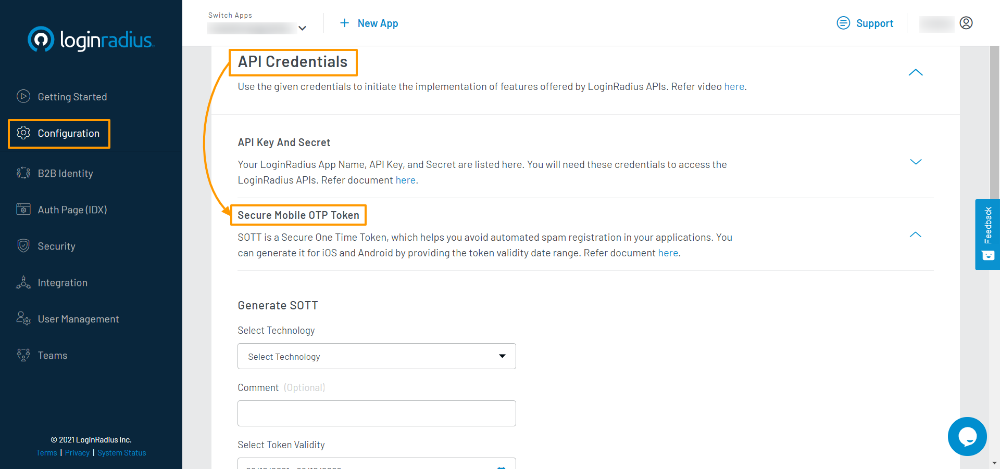

# Get Started - iOS

The tutorial lets you implement LoginRadius user registration, login, profile, and log out in your iOS mobile application.

> You must have OS X, Xcode, and iOS 9 or higher.
>
> [Create an account](https://accounts.loginradius.com/auth.aspx?return_url=https://dashboard.loginradius.com/login&action=register) to get started if you don't have one yet!

Watch this video to get started, or refer to the section below for the text-based guide.

<figure class="video_container">
<iframe width="560" height="315" src="https://www.youtube.com/embed/-3zZSRiOAZY" title="YouTube video player" frameborder="0" allow="accelerometer; autoplay; clipboard-write; encrypted-media; gyroscope; picture-in-picture" allowfullscreen></iframe></figure>

## Get Credentials

Before using any of the APIs or Methods that LoginRadius provides, you need to get your **App Name** (when you signed up for the LoginRadius account, it created an app for you), **API Key**, and **SOTT**.

- In your LoginRadius Dashboard, navigate to **[Configuration > API Credentials](https://dashboard.loginradius.com/configuration)** and click the **API Key And Secret** subsection to retrieve your App Name and API Key:

  

- Now click the **Secure Mobile OTP Token(SOTT)** subsection, the below screen will appear:

  

- Generate SOTT and make sure to copy the SOTT value (for security reasons, it's only visible once in the LoginRadius Dashboard).

## iOS Implementation

We recommend using CocoaPods for installing the library in a project.

CocoaPods is a dependency manager for Cocoa projects. You can install it with the following command:

```
$ gem install cocoapods

```

**Podfile**

Open a terminal window and navigate to the location of the Xcode project for your application. If you have not already created a `Podfile` for your application, create one now by running the following command:

```
$ pod init

```

## SDK Installation

Integrate LoginRadiusSDK into your Xcode project using CocoaPods by adding the following code snippet to your `Podfile`:

```
source 'https://github.com/CocoaPods/Specs.git '
platform :ios, '9.0'
target 'TargetName' do

# Comment the next line if you don't want to use dynamic frameworks
use_frameworks!
pod 'LoginRadiusSDK', '~> 5.4.2'
end

```
Install `pod` by running the following command in terminal:

```
$ pod install
```
## Configuration

1. Create a new File `LoginRadius.plist` and add it to your App.

2. Add the following entries to your `LoginRadius.plist`.

   ```
   <?xml version="1.0" encoding="UTF-8"?>
   <!DOCTYPE plist PUBLIC "-//Apple//DTD PLIST 1.0//EN" "http://www.apple.com/DTDs/PropertyList-1.0.dtd">
   <plist version="1.0">
   <dict>
      <key>apiKey</key>
      <string>API_Key</string>
      <key>siteName</key>
      <string>APP_Name</string>

   </dict>
   </plist>
   ```

   Replace the following placeholders in the above :

   - apiKey: **API Key** obtained in the [Get Credentials](#get-credentials) step.
   - siteName: **App Name** obtained in the [Get Credentials](#get-credentials) step.

3. Import the SDK with `import LoginRadiusSDK` and Initialize with your API key and Site name in your `AppDelegate.swift` as below.

   ```

   import LoginRadiusSDK
   ...

   @UIApplicationMain class AppDelegate: UIResponder, UIApplicationDelegate {

   ...

   func application(_ application: UIApplication, didFinishLaunchingWithOptions launchOptions:[UIApplicationLaunchOptionsKey: Any]?)  -> Bool {

            let sdk:LoginRadiusSDK = LoginRadiusSDK.instance();
            sdk.applicationLaunched(options: launchOptions);

            //Your code

            return true
   }

   ...

   }

   ```

## Implement Registration

> Add a button to your application that calls the below function for registration.

Add the following code to implement registration:

```
let email:AnyObject = [ "Type":"Primary","Value":"test@gmail.com" ] as AnyObject
let parameter:AnyObject = [ "Email": [email],
                            "Password":"password"
                          ]as AnyObject

AuthenticationAPI.authInstance().userRegistration(withSott:sott,payload:parameter as! [AnyHashable : Any], emailtemplate:nil, smstemplate:nil,preventVerificationEmail:false, completionHandler: { (data, error) in

        if let err = error
        {
            print(err.localizedDescription)
        }else{
            print("successfully registered");
        }

})
```

- sott: **SOTT** obtained in the [Get Credentials](#get-credentials) step.

## Implement Login

> Add a button to your application that calls the below function for login.

Add the following code to implement login:

```
let parameter:AnyObject = ["email":"email",
                           "password":"password",
                           "securityanswer":""
                          ]as AnyObject

AuthenticationAPI.authInstance().login(withPayload:parameter as! [AnyHashable : Any], loginurl:nil, emailtemplate:nil, smstemplate:nil, g_recaptcha_response:nil,completionHandler: { (data, error) in

     if let err = error {
        print(err.localizedDescription)
    } else {
        print("login successful")
    }
})
```

## Retrieve User Data using Access Token

> You will get an `access token` in response to Registration and Login functions.

Once the authentication is done, you can use the `access token` to retrieve profile data and handle other user functionality. Add the following code to get the user profile:

```
AuthenticationAPI.authInstance().profiles(withAccessToken:"<access_token>", completionHandler:{ (data, error) in

        if let err = error {
         print(err.localizedDescription)
        } else {
         print("success",data)
    }
})}

```

> Call the `profileswithAccessToken` function after login and verify that the user's profile information has been returned in the `data` field.

Here is an example user profile object that is returned from the `profileswithAccessToken` SDK call:

  ```
  {
    "Identities": null,
    "Password": "**********",
    "LastPasswordChangeDate": "2021-02-11T02:36:01.8420000Z",
    "PasswordExpirationDate": null,
    "LastPasswordChangeToken": null,
    "EmailVerified": true,
    "IsActive": true,
    "IsDeleted": false,
    "Uid": "0df01f54954d4e9f9b3b18c30fa5b0ea",
    "CustomFields": null,
    "IsEmailSubscribed": false,
    "UserName": null,
    "NoOfLogins": 6,
    "PhoneId": null,
    "PhoneIdVerified": false,
    "Roles": null,
    "ExternalUserLoginId": null,
    "RegistrationProvider": "Email",
    "IsLoginLocked": false,
    "LoginLockedType": "None",
    "LastLoginLocation": "Vancouver, Canada",
    "RegistrationSource": "https://***.hub.loginradius.com/",
    "IsCustomUid": false,
    "UnverifiedEmail": null,
    "IsSecurePassword": null,
    "PrivacyPolicy": null,
    "ExternalIds": null,
    "IsRequiredFieldsFilledOnce": true,
    "ConsentProfile": null,
    "PIN": null,
    "RegistrationData": null,
    "ID": "5446de8561ec47809325f9b430e2750e",
    "Provider": "Email",
    "Prefix": null,
    "FirstName": null,
    "MiddleName": null,
    "LastName": null,
    "Suffix": null,
    "FullName": null,
    "NickName": null,
    "ProfileName": null,
    "BirthDate": null,
    "Gender": null,
    "Website": null,
    "Email": [
      {
        "Type": "Primary",
        "Value": "***@***.com"
      }
    ],
    "Country": null,
    "ThumbnailImageUrl": null,
    "ImageUrl": null,
    "Favicon": null,
    "ProfileUrl": null,
    "HomeTown": null,
    "State": null,
    "City": null,
    "Industry": null,
    "About": null,
    "TimeZone": null,
    "LocalLanguage": null,
    "CoverPhoto": null,
    "TagLine": null,
    "Language": null,
    "Verified": null,
    "UpdatedTime": null,
    "Positions": null,
    "Educations": null,
    "PhoneNumbers": null,
    "IMAccounts": null,
    "Addresses": null,
    "MainAddress": null,
    "Created": null,
    "CreatedDate": "2020-10-15T22:09:55.8440000Z",
    "ModifiedDate": "2020-10-15T22:09:55.8630000Z",
    "ProfileModifiedDate": null,
    "LocalCity": "Vancouver",
    "ProfileCity": null,
    "LocalCountry": "Canada",
    "ProfileCountry": null,
    "FirstLogin": false,
    "IsProtected": false,
    "RelationshipStatus": null,
    "Quota": null,
    "Quote": null,
    "InterestedIn": null,
    "Interests": null,
    "Religion": null,
    "Political": null,
    "Sports": null,
    "InspirationalPeople": null,
    "HttpsImageUrl": null,
    "FollowersCount": 0,
    "FriendsCount": 0,
    "IsGeoEnabled": null,
    "TotalStatusesCount": 0,
    "Associations": null,
    "NumRecommenders": 0,
    "Honors": null,
    "Awards": null,
    "Skills": null,
    "CurrentStatus": null,
    "Certifications": null,
    "Courses": null,
    "Volunteer": null,
    "RecommendationsReceived": null,
    "Languages": null,
    "Projects": null,
    "Games": null,
    "Family": null,
    "TeleVisionShow": null,
    "MutualFriends": null,
    "Movies": null,
    "Books": null,
    "AgeRange": null,
    "PublicRepository": null,
    "Hireable": false,
    "RepositoryUrl": null,
    "Age": null,
    "Patents": null,
    "FavoriteThings": null,
    "ProfessionalHeadline": null,
    "ProviderAccessCredential": null,
    "RelatedProfileViews": null,
    "KloutScore": null,
    "LRUserID": null,
    "PlacesLived": null,
    "Publications": null,
    "JobBookmarks": null,
    "Suggestions": null,
    "Badges": null,
    "MemberUrlResources": null,
    "TotalPrivateRepository": 0,
    "Currency": null,
    "StarredUrl": null,
    "GistsUrl": null,
    "PublicGists": 0,
    "PrivateGists": 0,
    "Subscription": null,
    "Company": null,
    "GravatarImageUrl": null,
    "ProfileImageUrls": null,
    "WebProfiles": null,
    "PinsCount": 0,
    "BoardsCount": 0,
    "LikesCount": 0,
    "SignupDate": "2020-10-15T22:09:55.8440000Z",
    "LastLoginDate": "2021-02-16T19:53:28.3120000Z",
    "PreviousUids": null
  }
  ```
## Explore iOS Demo

Check out our iOS demo to know how you can implement various LoginRadius features using SDK and its functions.

**[GitHub Demo Link](https://github.com/LoginRadius/ios-sdk)** | **[Download Demo](https://github.com/LoginRadius/ios-sdk/archive/master.zip)**

## Recommended Next Steps

[How to manage email templates for verification and forgot password](/guide/customize-email-and-sms-settings)

[How to personalize interfaces and branding of login pages](/guide/customize-auth-page)

[How to configure SMTP settings for sending emails to consumers](/guide/setup-your-smtp-provider)

[How to implement Social Login options like Facebook, Google](/guide/social-login)

[How to implement Phone Login](/guide/phone-login)

[How to implement Passwordless Login](/guide/passwordless-login)

## IOS SDK Reference

[IOS SDK](/references/sdk/ios-sdk)

## API Reference

[APIs](/#api)

[Go Back to Home Page](/)

