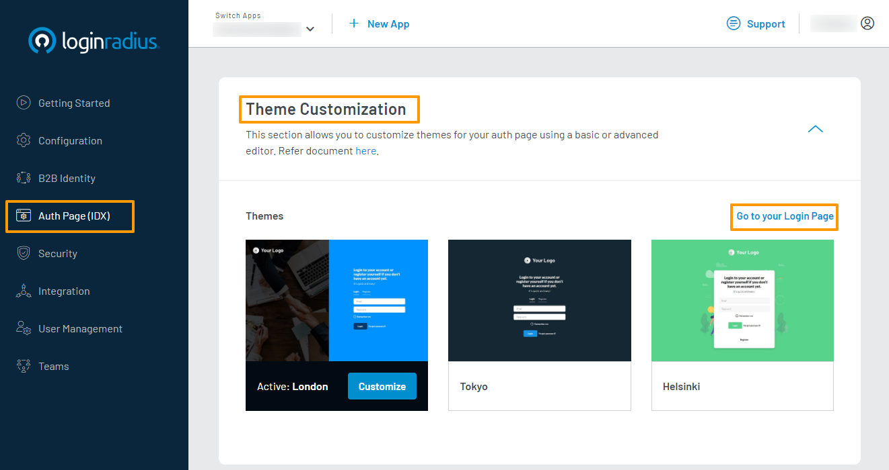

# Get Started - Node.js

The tutorial lets you implement LoginRadius user registration, login, profile, and log out in your Node.js based application. 

## Choose Theme

In your LoginRadius Dashboard, select the **Auth Page (IDX)** from the left navigation and then click the **Theme Customization** to to select a design theme for your login page, or further customize the content displayed:

To preview your login page's theme, click **Go to your Login Page** link as highlighted on the above screen. Features like Email and Password login, User registration, Forgot password, and Remember me are already implemented on your Auth Page(IDX).

## Get Credentials

Before using any of the APIs or Methods that LoginRadius provides, you need to get your **App Name**, **API Key**, and **API Secret**.

In your LoginRadius Dashboard, navigate to **[Configuration > API Credentials](https://dashboard.loginradius.com/configuration)** and click the **API Key And Secret** subsection to retrieve your API Credentials.

## Java Implementation

## SDK Implementation

[Go Back to Home Page](https://lr-developer-docs.netlify.app)