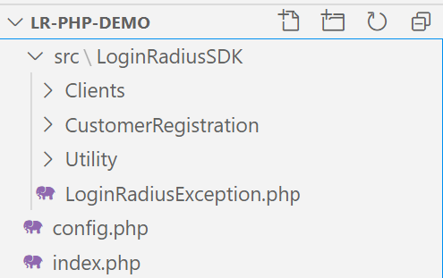
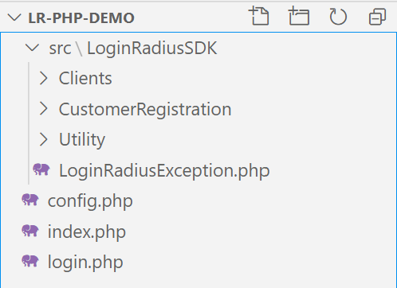
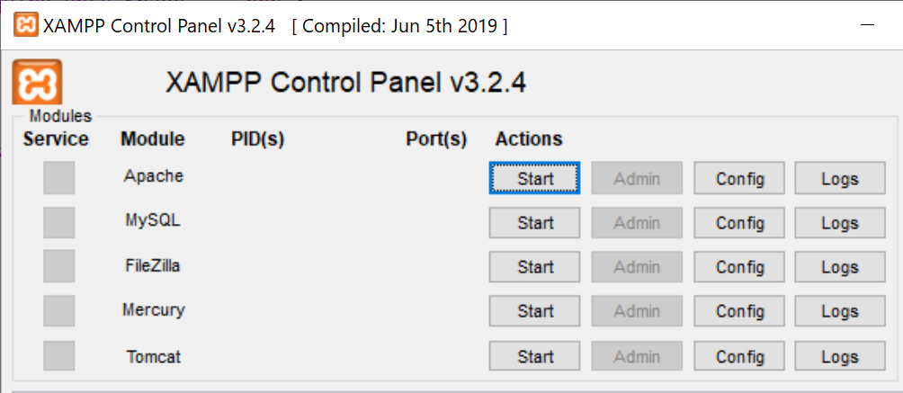
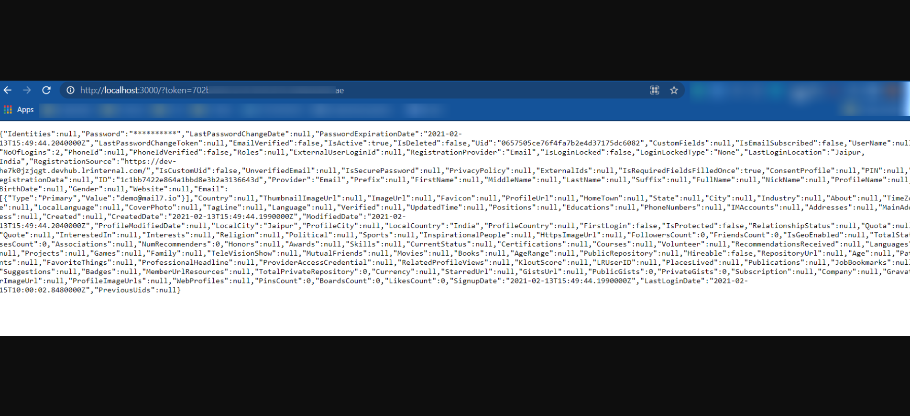

# Get Started - PHP

The tutorial lets you implement LoginRadius user registration, login, and view profile on your PHP web application. 

> [Create an account](https://accounts.loginradius.com/auth.aspx?return_url=https://dashboard.loginradius.com/login&action=register) to get started if you don't have one yet!

When you signed up for the LoginRadius account, it created an app for you. This app is linked to a ready to use web page - [Auth Page (IDX)](https://www.loginradius.com/docs/developer/concepts/idx-overview/).

Auth Page (IDX) reflects the configuration changes that you make in [LoginRadius Dashboard](https://dashboard.loginradius.com/getting-started). You can utilize this webpage for authentication requirements on your PHP application.


## Choose Theme

In your LoginRadius Dashboard, select the **Auth Page (IDX)** from the left navigation and then click the **Theme Customization** to select a design theme for your login page, or further customize the content displayed:


To preview your login page's theme, click the **Go to your Login Page** link highlighted on the above screen. 

> Features like Email and Password login, User registration, Forgot password, and Remember me are already configured on your Auth Page(IDX).


## Get Credentials

Before using any of the APIs or Methods that LoginRadius provides, you need to get your **App Name**, **API Key**, and **API Secret**.

In your LoginRadius Dashboard, navigate to **[Configuration > API Credentials](https://dashboard.loginradius.com/configuration)** and click the **API Key And Secret** subsection to retrieve your API Credentials.


## Setup PHP 

In this example, we will leverage the [LoginRadius PHP SDK](https://github.com/LoginRadius/php-sdk) to retrieve the user profile after login. To obtain a copy of the SDK, there are two methods:

1. Install the SDK through [Composer](http://getcomposer.org/):

    `curl -sS https://getcomposer.org/installer | php`

    Next, run the Composer command to install the latest stable version of the library:

    `composer require loginradius/php-sdk:11.0.0`

2. Clone or download the source from [LoginRadius official github repository.](https://github.com/LoginRadius/php-sdk)

<br>

   - Once you finish downloading/installing the SDK, we can begin setting up the directory for our sample project. Create a separate folder from the SDK folder and name it `lr-php-demo`.

   - Browse the SDK folder and copy the `src` folder from SDK into `lr-php-demo` folder.

   - Next, create a new file in `lr-php-demo` named `config.php`. Populate the file with the code below. This file will supply required configurations and import the LoginRadius SDK into the project:

    ```PHP
    <?php
    define('LR_API_KEY', '{{YOUR API KEY}}');
    define('LR_API_SECRET', '{{YOUR API SECRET}}');  // Pass API Secret Key

    //If you have Custom API Domain, then define 'API_DOMAIN' then replaced it with your custom API domain,
    //otherwise no need to define these options in configuration.
    // define('API_DOMAIN', 'https://api.loginradius.com'); 

    require_once "./src/LoginRadiusSDK/Utility/Functions.php";
    require_once "./src/LoginRadiusSDK/LoginRadiusException.php";
    require_once "./src/LoginRadiusSDK/Clients/IHttpClientInterface.php";
    require_once "./src/LoginRadiusSDK/Clients/DefaultHttpClient.php";


    require_once "./src/LoginRadiusSDK/CustomerRegistration/Authentication/AuthenticationAPI.php";
    require_once "./src/LoginRadiusSDK/CustomerRegistration/Authentication/OneTouchLoginAPI.php";
    require_once "./src/LoginRadiusSDK/CustomerRegistration/Authentication/PasswordLessLoginAPI.php";
    require_once "./src/LoginRadiusSDK/CustomerRegistration/Authentication/PhoneAuthenticationAPI.php";
    require_once "./src/LoginRadiusSDK/CustomerRegistration/Authentication/RiskBasedAuthenticationAPI.php";
    require_once "./src/LoginRadiusSDK/CustomerRegistration/Authentication/RiskBasedAuthenticationAPI.php";
    require_once "./src/LoginRadiusSDK/CustomerRegistration/Authentication/SmartLoginAPI.php";

    require_once "./src/LoginRadiusSDK/CustomerRegistration/Account/AccountAPI.php";
    require_once "./src/LoginRadiusSDK/CustomerRegistration/Account/RoleAPI.php";
    require_once "./src/LoginRadiusSDK/CustomerRegistration/Account/SottAPI.php";

    require_once "./src/LoginRadiusSDK/CustomerRegistration/Advanced/ConfigurationAPI.php";
    require_once "./src/LoginRadiusSDK/CustomerRegistration/Advanced/CustomObjectAPI.php";
    require_once "./src/LoginRadiusSDK/CustomerRegistration/Advanced/CustomRegistrationDataAPI.php";
    require_once "./src/LoginRadiusSDK/CustomerRegistration/Advanced/MultiFactorAuthenticationAPI.php";
    require_once "./src/LoginRadiusSDK/CustomerRegistration/Advanced/CustomRegistrationDataAPI.php";
    require_once "./src/LoginRadiusSDK/CustomerRegistration/Social/NativeSocialAPI.php";
    require_once "./src/LoginRadiusSDK/CustomerRegistration/Social/SocialAPI.php";
    ?>
    ```

   - Replace the following placeholder in the above code:
    {{YOUR API KEY}} and {{YOUR API SECRET}}: API Key and Secret obtained in the [Get Credentials](#get-credentials) step.


- Now we can create a simple `index.php` file with simple HTML to act as the landing page:

    ```HTML
    <!DOCTYPE html>
    <html lang="en">

    <head>
    <title>PHP Demo Index Page</title>
    </head>

    <body>
    <div>
        <h1>PHP Demo Landing Page</h1>
    </div>
    </body>

    </html>
    ```

- At this step, your project directory should look like this:

    

    And we are ready to implement the `login` route 

## Configure Registration and Login URLs

> This tutorial uses Auth Page(IDX) for authentication, where Registration and Login functionality is already implemented. 

Navigate your Register or Login links or buttons to the following URLs:

**Registration Page URL:**

`https://<LoginRadius APP Name>.hub.loginradius.com/auth.aspx?action=register&return_url=<Return URL>`

**Login Page URL:**

`https://<LoginRadius APP Name>.hub.loginradius.com/auth.aspx?action=login&return_url=<Return URL>`

**Where:**
- **LoginRadius App Name** is the name of your app as mentioned in [Get Credentials](#get-credentials) step.
- **return_url** is where you want to redirect users upon successful registration or login. [Whitelist your domain](#whitelist-your-domain) if you are not using Local Domain for this tutorial. 

> return_url can be your website, frontend app, or backend server url where you are handling the access token. 


## Retrieve User Data using Access Token

> Once the authentication is done using Auth Page (IDX), the default script of LoginRadius sends an access token in the query string as a token parameter with the return_url. The return_url should be your application's web page where you would like to receive the access token.
>The following is an example of the access token in the query string with the Return URL:
>
>`<Return URL>?token=745******-3e8e-****-b3**2-9c0******1e.`
>
> Point return_url to a route in your PHP application to capture the access token and retrieve the user profile data.

- From the PHP application side, we will now implement the `/login` route to receive the token and fetch the corresponding user profile. Create a new file named `login.php` and populate it with the following content:

```PHP
<!DOCTYPE html>
<html lang="en">

<style>
  span {
    white-space: pre-wrap;
    text-align: left;
    font-family: Arial, Helvetica, sans-serif;
  }
</style>

<head>
  <title>PHP Demo Login Route</title>
</head>

<body>
  <span>
    <?php
      require_once 'config.php';
      use \LoginRadiusSDK\CustomerRegistration\Authentication\AuthenticationAPI;

      function getProfileByToken() {
        $token = isset($_GET['token']) ? trim($_GET['token']) : '';
        $response = array('status' => 'error', 'message' => 'An error occurred.');

        if (empty($token)) {
          $response['message'] = 'Access Token is a required field.';
        }
        else {
          $authObj = new AuthenticationAPI();
          $fields = '';
          try {
            $fields = '';
            $result = $authObj->getProfileByAccessToken($token, $fields);
            if ((isset($result->Uid) && $result->Uid != '')) {
              $response['data'] = $result;
              $response['message'] = "Profile successfully retrieved.";
              $response['status'] = 'success';
            }
          }
          catch (LoginRadiusException $e) {
            $response['message'] = $e->getMessage();
            $response['status'] = "error";
          }
        }
        return json_encode($response, JSON_PRETTY_PRINT);
      }

      $retrieveProfileResponse = getProfileByToken();

      echo $retrieveProfileResponse;
    ?>
  </span>
</body>

</html>
```

- The complete folder structure of `lr-php-demo` should now look like this:

    


- Once the `/login` route is implemented, set the `return_url` to point to the `/login` subdomain of your application. For example, in the local PHP server instance that will be introduced in the subsequent section, it can point to `http://localhost/lr-php-demo/login.php`. This way, after logging in through the Auth Page (IDX), your user will be redirected to the `/login` route that we just implemented.

## Run and See Result

- To run the sample application locally for testing purposes, we will utilize [XAMPP](https://www.apachefriends.org/index.html) to deploy a local PHP server.

- With XAMPP installed, navigate to the XAMPP installation folder and locate the `htdocs` folder. Now copy the `lr-php-demo` folder we created earlier and paste it inside `htdocs`.

- Once this is done, launch the XAMPP Control Panel. From the menu, click Start on the Apache module:

    

- The server should be up at this point. To verify, navigate to http://localhost/lr-php-demo, and you should see a "PHP Demo Landing Page" header. This is the landing page we created previously.

- Open your Auth Page(IDX) registration URL `https://<LoginRadius APP Name>.hub.loginradius.com/auth.aspx?action=register&return_url=http://localhost/lr-php-demo/login.php`. It will display the following screen:

  

- Register a user here and then log in. Upon successful login, it will redirect you to the return url with the access token. In response, you will get a user profile in the JSON format displayed in the "/login" route. The following displays a sample JSON response:

  

> In addition to Registration and Login actions, the Auth Page (IDX) supports more actions. Refer to [this document](https://www.loginradius.com/docs/developer/concepts/idx-overview/) for more information.

##  Whitelist Your Domain

For security reasons, LoginRadius processes the API calls that are received from the whitelisted domains. Local domains (http://localhost and http://127.0.0.1) are whitelisted by default. 

To whitelist your domain, in your LoginRadius Dashboard, navigate to **[Configuration > Whitelist Your Domain](https://dashboard.loginradius.com/configuration)** and add your domain name:


##  Explore PHP Demo/SDK

The tutorial above walks through a quick PHP implementation to import the SDK and leverage it to process user data from LoginRadius in the frontend. For a more structured example of a PHP server, check out the demo and SDK references from our LoginRadius repository.

**[GitHub Demo/SDK Link](https://github.com/LoginRadius/php-sdk)**   |   **[Download Demo](https://github.com/LoginRadius/php-sdk/archive/master.zip)**   


# Recommended Next Steps

How to manage email templates for verification and forgot password

How to personalize interfaces and branding of login pages

How to configure SMTP settings for sending emails to consumers

How to implement Social Login options like Facebook, Google

How to implement Phone Login

How to implement Passwordless Login


# PHP SDK Reference

[PHP SDK](/references/sdk/php)

# API Reference

[API Reference](/#api)


[Go Back to Home Page](/)
