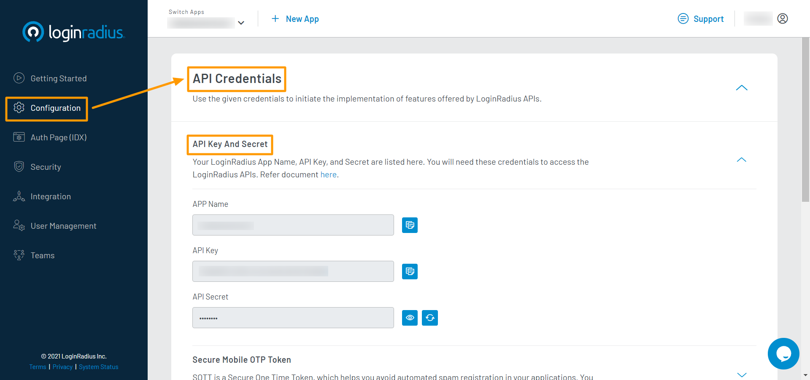

# Get Started - Python

The tutorial lets you implement LoginRadius user registration, login, profile, and log out in your python based application.

> You must have python installed, and the minimum supported version is 2.7.
>
> New to Python? Check out [this reference](https://www.python.org/about/).


When you signed up for the LoginRadius account, it created an app for you. This app is linked to a ready to use web page - [Auth Page (IDX)](https://www.loginradius.com/docs/developer/concepts/idx-overview/).

Auth Page (IDX) reflects the configuration changes that you make in [LoginRadius Dashboard](https://dashboard.loginradius.com/getting-started). You can utilize this webpage for authentication requirements on your python application.

> [Create an account](https://accounts.loginradius.com/auth.aspx?return_url=https://dashboard.loginradius.com/login&action=register) to get started if you don't have one yet!

## Choose Theme

In your LoginRadius Dashboard, select the **Auth Page (IDX)** from the left navigation and then click the **Theme Customization** to select a design theme for your login page, or further customize the content displayed:


To preview your login page's theme, click **Go to your Login Page** link highlighted on the above screen. 

> Features like Email and Password login, User registration, Forgot password, and Remember me are already configured for your Auth Page(IDX).

## Get Credentials

Before using any of the APIs or Methods that LoginRadius provides, you need to get your **App Name**, **API Key**, and **API Secret**.

In your LoginRadius Dashboard, navigate to **[Configuration > API Credentials](https://dashboard.loginradius.com/configuration)** and click the **API Key And Secret** subsection to retrieve your API Credentials.



## Setup Virtualenv

* Check if pip package manager is installed by running the following command:

    `pip -h`

* Install virutalenv by running the following command:

    `pip install virtualenv`
    
* Create the virtual environment by running the following command:
    
    `virtualenv python_demo`

* Activate the virtualenv, the following are the commands for MacOS/Linux and Windows:

  * For MacOS/Linux: `source python_demo/bin/activate`
  * For Windows: `python_demo\Scripts\activate`

## Setup Project

This implementation uses the flask framework to create Python API.

* Install flask by running the following command:

  `pip install Flask`

* Create a requirement file `pip freeze > requirements.txt`.

* Create a new file name `app.py` and add the following code snippet:

  ```
  from flask import Flask
  app = Flask(__name__)

  @app.route("/")
  def hello():

   return "Hello World!"

  if __name__ == "__main__":
  
   app.run()
  ```

Now, try running new Flask application with the command `python app.py`. Open http://localhost:5000 in your browser, and you should see the “Hello World!” response.

## Install SDK

Add project dependency and LoginRadius SDK using pip by running the following command in the command line:

`pip install requests loginradius-v2==11.0.0`

## Configure Project

Create a file name `config.py` and add the following lines:

```
from LoginRadius import LoginRadius as LR

API_KEY = ""
API_SECRET = ""

LR.API_KEY = API_KEY
LR.API_SECRET = API_SECRET
LR.CUSTOM_DOMAIN = "https://example.com/"
loginradius = LR()     

```

Replace the placeholders in the above config object with the following values:

* apiKey: **API Key** obtained in the [Get Credentials](#get-credentials) step.
* apiSecret: **API Secret** obtained in the [Get Credentials](#get-credentials) step.

## Configure Registration and Login URLs

> This tutorial uses Auth Page(IDX) for authentication, where Registration and Login functionality is already implemented.

Navigate your Register or Login links or buttons to the following URLs:

**Registration Page URL:**

`https://<LoginRadius APP Name>.hub.loginradius.com/auth.aspx?action=register&return_url=<Return URL>`

**Login Page URL:**

`https://<LoginRadius APP Name>.hub.loginradius.com/auth.aspx?action=login&return_url=<Return URL>`

**Where:**

* **LoginRadius App Name** is the name of your app as mentioned in the [Get Credentials](#get-credentials) step.
* **return_url** is where you want to redirect users upon successful registration or login. [Whitelist your domain](#whitelist-domain) if you are not using Local Domain for this tutorial.

> return_url can be your website, frontend app, or backend server url where you are handling the access token.

## Retrieve User Data using Access Token

> Once the authentication is done using Auth Page (IDX), the default script of LoginRadius sends an access token in the query string as a token parameter with the return_url. The return_url will access the Python backend API with query parameter (access token).
>
> The following is an example of the access token in the query string with the Return URL:
>
> `<Return URL>?token=745******-3e8e-****-b3**2-9c0******1e.`
>
> If return_url is of frontend, pass the token to backend python API (eg: http://localhost:5000) from the application. Or you can use the path of the back end API as the return_url.

Add the following API snippet to `app.py`to get the user profile using the access token:

```
@user.route("/user")
def get_user():
	res = loginradius.authentication.get_profile_by_access_token(request.args['token'])
	if 'ErrorCode' in res:
		return abort(Response(res['Description'], 400))
	else:
		return jsonify(res)
```

## Run and See Result

* Run the API Server by executing the following command in the command line:
  [`python app.py`]

* Open your Auth Page(IDX) registration URL `https://<LoginRadius APP Name>.hub.loginradius.com/auth.aspx?action=register&return_url=<Return URL>`. It will display the following screen:

  

* Register a user here and then log in. Upon successful login, it will redirect you to the return url with the access token. In response, you will get a user profile in JSON format.

Similarly, you can implement more features using Python SDK.

> In addition to Registration and Login actions, the Auth Page (IDX) supports more actions. Refer to [this document](https://www.loginradius.com/docs/developer/concepts/idx-overview/) for more information.

## Whitelist Domain

For security reasons, LoginRadius processes the API calls that are received from the whitelisted domains. Local domains (http://localhost and http://127.0.0.1) are whitelisted by default.

To whitelist your domain, in your LoginRadius Dashboard, navigate to **[Configuration > Domain Whitelisting](https://dashboard.loginradius.com/configuration)** and add your domain name:


## Explore Python Github Demo

* **[Refer to GitHub Demo](https://github.com/LoginRadius/login-page-demos/tree/master/python-idx-demo/Demo)**  to know how to implement various LoginRadius features using SDK Functions.

## Python SDK Reference

* **[Python SDK](https://github.com/LoginRadius/python-sdk)**
