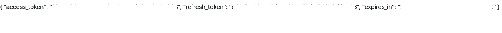

# Get Started - React.js

The tutorial lets you implement LoginRadius user registration, login, and view profile on your React.js based application. It makes use of the LoginRadius React SDK.  

> <a href="https://accounts.loginradius.com/auth.aspx?return_url=https://dashboard.loginradius.com/login&action=register" target="_blank">Create an account</a> to get started if you don't have one yet!

When you signed up for the LoginRadius account, it created an app for you. This app is linked to a ready to use web page - <a href="https://www.loginradius.com/docs/developer/concepts/idx" target="_blank">Auth Page (IDX)</a>.

Auth Page (IDX) reflects the configuration changes that you make in <a href="https://dashboard.loginradius.com/getting-started" target="_blank"> LoginRadius Dashboard</a>. You can utilize this webpage for authentication requirements on your React.js application.

## Choose Theme

In your LoginRadius Dashboard, select your app, then navigate to the **Auth Page (IDX)** section located in the left navigation bar and click the **Theme Customization** section. There you can select a design theme for your login page, or further customize the content displayed:


To preview your login page's theme, click the **Go to your Login Page** link highlighted on the above screen. 

> Features like Email and Password login, User registration, Forgot password, and Remember me are already configured on your Auth Page(IDX).

## Get Credentials

Before using any of the APIs or Methods that LoginRadius provides, you need to get your **App Name**, **API Key**, and **API Secret**.

In your LoginRadius Dashboard, navigate to **<a href="https://dashboard.loginradius.com/configuration" target="_blank">Configuration > API Credentials</a>** and click the **API Key And Secret** subsection to retrieve your API Credentials.


## Whitelist Your Domain

For security reasons, LoginRadius processes the API calls that are received from the whitelisted domains. Local domains (http://localhost and http://127.0.0.1) are whitelisted by default.

To whitelist your domain, in your LoginRadius Dashboard, navigate to **<a href="https://dashboard.loginradius.com/configuration" target="_blank">Configuration > Whitelist Your Domain</a>** and add your domain name:


## About LoginRadius React SDK

We will be using the [LoginRadius React SDK](https://github.com/LoginRadius/loginradius-react) to implement different functionalities in our application. The SDK makes use of [React Context](https://reactjs.org/docs/context.html) to manage the authentication state of your users. It can easily be installed using the `npm` package manager as explained later. 

## Setup React JS

This example uses a sample app based on the Create React App (CRA) boilerplate. For directions on how to Create React App, you can reference <a href="https://reactjs.org/docs/create-a-new-react-app.html" target="_blank">here.</a> 

Once the CRA boilerplate is set up, follow these steps:

- ### Install LoginRadius React SDK
    
    Navigate to the root of the project and install `loginradius-react`:
  
  `npm install loginradius-react`

- Navigate to the project root and install `react-router-dom`:

  `npm install react-router-dom`

- Setup a `.env.local` file at the project root with the following details:
  ```Shell 
  REACT_APP_LR_APP_NAME =<value>
  REACT_APP_API_KEY =<value>
  ```

- Go to `index.js` file and add the following code: 
  ```JavaScript
  import React from "react";
  import ReactDOM from "react-dom";
  import App from "./App";
  import { LRAuthProvider } from "loginradius-react";

  ReactDOM.render(
    <React.StrictMode>
      <LRAuthProvider
        appName={process.env.REACT_APP_LR_APP_NAME || ""}
        apiKey={process.env.REACT_APP_API_KEY || ""}
        redirectUri={window.location.origin}
      >
        <App />
      </LRAuthProvider>
    </React.StrictMode>,
    document.getElementById("root")
  );
  ```

- Go to `App.js` and modify the App component as follows:

  ```JavaScript
  import './App.css';
  import {
    BrowserRouter as Router,
    Switch,
    Route
  } from "react-router-dom";
  import Login from './Login'

  function App() {
    return (
      <Router>
        <div className="App">
          <Switch>
            <Route exact path="/">
              <div>{"Application home"}</div>
            </Route>
          </Switch>
        </div>
      </Router>
    );
  }

  export default App;
  ```

## Configure Authentication Flow


We will make use of the `loginWithRedirect`, `loginWithPopup` and `logout` authentication methods from the `useLRAuth` hook in our components to quickly setup an authentication flow for our application. We can also get access to the authentication state using `isAuthenticated`. 
- Create a `Landing.js` file under the `src` folder and populate it as shown below. This component will act as the `Landing Page` for our application. 

``` JavaScript
import { useLRAuth } from "loginradius-react";

const Auth = () => {

const {isAuthenticated,loginWithRedirect,logout } =  useLRAuth();
  if (isAuthenticated) {
    return (
      <div>
        <button onClick={() => logout()}>
          Log out
        </button>
      </div>
    );
  } else {
    
    return <button onClick={() => loginWithRedirect("/login")}>Login/Register</button>;

  }
}; 

export default Auth;     
``` 

Make sure to add the `Auth` component to the `"/"` route in the `App.js` file. 
>  - The loginWithRedirect() and logout() methods make use of the Auth Page(IDX), where Registration and Login functionality is already implemented. 
>  - The URL's used by the methods are of the format `https://<LoginRadius APP Name>.hub.loginradius.com/auth.aspx?action=<value>&return_url=<Return URL>` where action's value(login,logout etc.) changes based on the functionality. 
>  - The **return_url** is where the users will be redirected to after an action is performed successfully. It has a default value of `window.location.origin` and can be modified by passing a string as a paramter to the respective method as shown above.  

## Retrieve User Data 

- Add the `"/login"` route to the `App` component to get the user profile. Your `App.js` file should now look like this:

  ```JavaScript
  import './App.css';
  import {
    BrowserRouter as Router,
    Switch,
    Route
  } from "react-router-dom";
  import Auth from './Landing'
  import Login from './Login'

  function App() {
    return (
      <Router>
        <div className="App">
          <Switch>
            <Route exact path="/">
              <div>{"Application home"}</div>
              <Auth />
            </Route>
            <Route path="/login">
              <Login />
            </Route>
          </Switch>
        </div>
      </Router>
    );
  }

  export default App;
  ```

- Create a `Login` folder (case-sensitive) for the new component under the `src` folder, then create a new empty file `index.js` within `Login` folder:

  

- Populate the `src/Login/index.js` file with:

  ```JavaScript
  import React from "react"
  import { useLRAuth, withAuthenticationRequired } from "loginradius-react";

  const Login = () => {
  const { user } = useLRAuth();
  return (
  <div>
    <span style={{ whiteSpace: "pre-wrap", textAlign: "left" }}>
      {JSON.stringify(user, null, 4)}
    </span>
  </div>
   );
  } 
  export default withAuthenticationRequired(Login, {
  onRedirecting: () => <div>Loading...</div>, returnTo: '/login',
  });
  ```
Here, we have used the `user` method from the `useLRAuth` hook to get access to user related data. We can protect a route component using the `withAuthenticationRequired` higher order component. This is shown in the above code for the `Login` component. Any visits made to the protected route when the user is unauthenticated, will redirect the user to the login page. The user will be redirected to the protected page only after authentication is completed.  

> Also, we can fetch the access token by using the `getAccessTokenSilently` method from the `useLRAuth` hook. This access token can be used to fetch data from different APIs as shown [here](#call-an-api).


## Run and See Result  

- From your command line, run the React application:

  `npm start`

- Wait for the application to finish launching. 

- Click the `Login/Register` button on the Home Page to login or register as a user to the application. It will display the following screen:

  

- Upon successful login, it will redirect you to the return url. In response, you will get user profile in JSON format displayed in the `"/login"` route. The following displays a sample JSON response: 

  

> In addition to Registration and Login actions, the Auth Page (IDX) supports more actions. Refer to <a href="https://www.loginradius.com/docs/developer/concepts/idx/" target="_blank">this document</a> for more information.

## Call An API  

As an additional feature, we can use the LoginRadius React SDK to easily call API's with an access token. The token can be obtained by using the `getAccessTokenSilently` method from the `useLRAuth` hook. To test this out, create a new file/component with the below code. A route for this component can later be created in the `App.js` file. 

``` JavaScript
import React, { useEffect, useState } from "react";
import { useLRAuth, withAuthenticationRequired } from "loginradius-react";

const CallAPI = () => {
  const { getAccessTokenSilently } = useLRAuth();
  const [resp, setResp] = useState(null);

  useEffect(() => {
    (async () => {
      try {
        const token = await getAccessTokenSilently();
        const response = await fetch(
        `https://api.loginradius.com/identity/v2/auth/access_token/validate?access_token=${token}&apiKey=${process.env.REACT_APP_API_KEY}`,
          {}
        );
        setResp(await response.json());
      } catch (e) {
        console.error(e);
      }
    })();
  }, [getAccessTokenSilently]);

  if (!resp) {
    return <div>Loading...</div>;
  }

  return (
    <span>{JSON.stringify(resp, null, 2)}</span>
  );
};

export default withAuthenticationRequired(CallAPI, {
    onRedirecting: () => <div>Loading...</div>, 
    });

```
Here, we are fetching data from the LoginRadius [Auth Validate Access Token](https://www.loginradius.com/docs/developer/references/api/authentication#auth-validate-access-token) API. 

The following displays a sample output for this API:



A similar approach can be used for any API. 


## Explore React SDK

LoginRadius React SDK is an open-source software. If you wish to contribute or get a better understanding of the concepts explained in this guide, refer the [React SDK](https://github.com/LoginRadius/loginradius-react) repository. You can find `working examples` of the LoginRadius React SDK [here](https://github.com/LoginRadius/loginradius-react/tree/main/examples).


## Recommended Next Steps

* <a href="https://www.loginradius.com/docs/developer/guide/customize-email-and-sms-settings" target="_blank">How to manage email templates for verification and forgot password</a>

* <a href="https://www.loginradius.com/docs/developer/guide/customize-auth-page" target="_blank">How to personalize interfaces and branding of login pages</a>

* <a href="https://www.loginradius.com/docs/developer/guide/setup-your-smtp-provider" target="_blank">How to configure SMTP settings for sending emails to consumers</a>

* <a href="https://www.loginradius.com/docs/developer/guide/social-login" target="_blank">How to implement Social Login options like Facebook, Google</a>

* <a href="https://www.loginradius.com/docs/developer/guide/phone-login" target="_blank">How to implement Phone Login</a>

* <a href="https://www.loginradius.com/docs/developer/guide/passwordless-login" target="_blank">How to implement Passwordless Login</a>

## React SDK Reference

<a href="https://github.com/LoginRadius/loginradius-react" target="_blank">React SDK</a>

## API Reference

[APIs](/#api)

[Go Back to Home Page](/)
